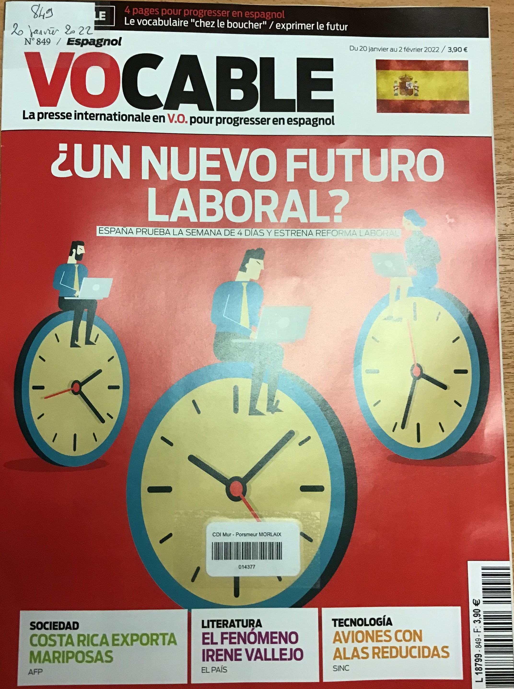

???+ info "Exposition en cours"
    
    * **"Frida KAHLO"**
        {width=20%}
	Exposition réalisée par les élèves du cours d'Espagnol
		
        Pour aller plus loin : [Frida Kahlo - France Culture]( https://www.franceculture.fr/personne-frida-kahlo.html)
   

??? info "Dernières nouvautés abonnements"
   
    {width=20%}
    {width=20%}
    {width=20%}
    {width=20%}
    {width=20%}
    {width=20%}
    {width=20%}
    {width=20%}
    {width=20%}
    {width=20%}
    

    
	

