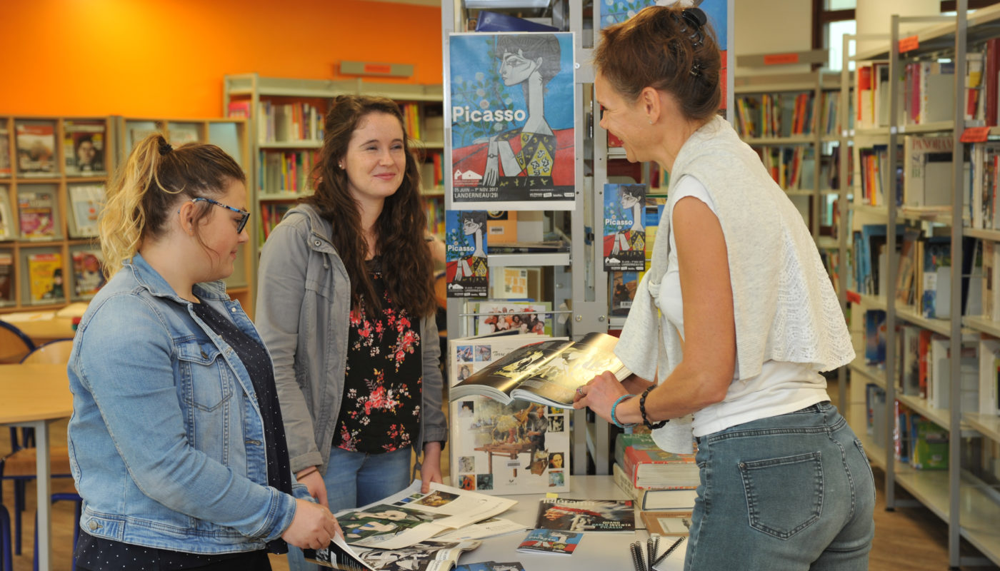

# CENTRE DE DOCUMENTATION ET D'INFORMATION
LYCEE NOTRE-DAME-DU-MUR/LE PORSMEUR - MORLAIX (29)

{width=40% align=left}
Bienvenue sur le site du CDI de notre lycée...
Les documentalistes Jocelyne COZ et Claire LEOST vous accueillent en continu du lundi au vendredi.

-------

??? question "Pourquoi venir au CDI ? ..."

    * Travailler dans un endroit agréable et propice à la concentration

    * Faire des recherches en lien avec mes disciplines d'enseignement

    * Réfléchir et étayer mon projet d'orientation

    * Avancer mon travail personnel

    * Lire la presse, des fictions ou des documentaires

    * Découvrir les nouveautés

    * Emprunter des documents

??? info "Horaires d'ouverture"
        
    | Lundi    |   9h - 18h30 |
    
    | Mardi    | 8h30 - 18h30 |
    
    | Mercredi | 8h30 - 18h30 |
    
    | Jeudi    | 8h30 - 18h30 |
    
    | Vendredi | 8h30 - 16h30 |
  
L’accès aux ressources des CDI (ouvrages, articles de périodiques, sites internet et informations diverses) est facilité grâce aux portails d’information accessibles en ligne.

   * [**Portail - Base documentaire PMB**](https://ecmorlaix.basecdi.fr/pmb/opac_css/)

   * [**Padlet du CDI**](https://padlet.com/cdinddmporsmeur/CDI)

 
