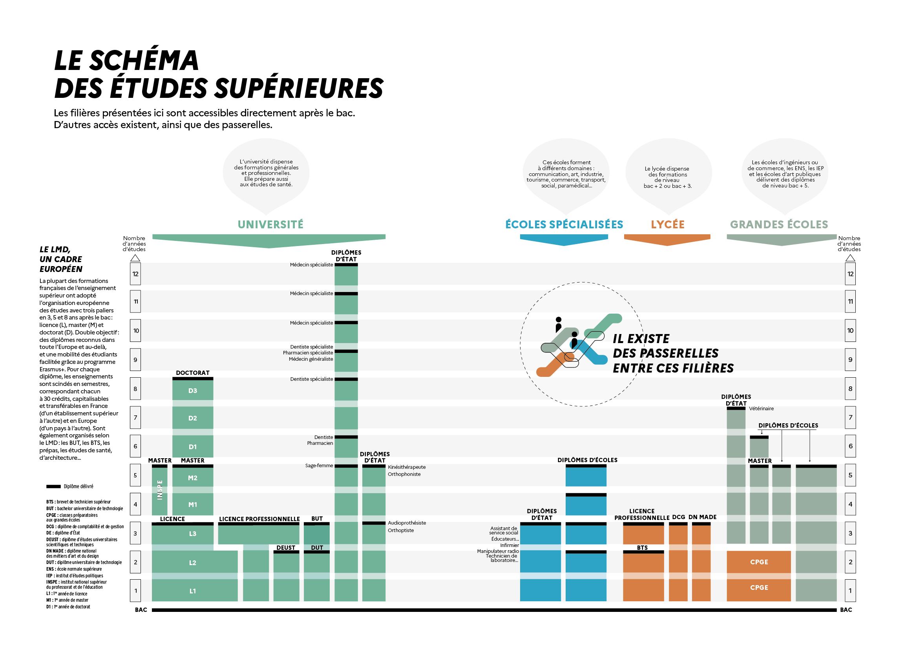

???+ info "Orientation et Parcours avenir"

    Ressources pour l'orientation par niveau    
    Actualité de l'orientation    
    Sites incontournables  
    Salons et forums  
    Vie étudiante
    
   
=== "Parcours AVENIR"
    [Ressources communes](https://padlet.com/cdinddmporsmeur/ORI_2020)
    
    [GUIDE_ENTRER_DANS_LE_SUP_2022](./pdf/GUIDE_ENTRER_DANS_LE_SUP_2022.pdf){target=_blank}
=== "SECONDE"
    [Vers le padlet seconde](https://padlet.com/cdinddmporsmeur/orientation_seconde_2020)
=== "PREMIERE"
    [Vers le padlet première](https://padlet.com/cdinddmporsmeur/orientation_premiere_2020)
=== "TERMINALE"
    - [Calendrier PARCOURSUP](https://www.parcoursup.fr/index.php?desc=calendrier) 
    - [Vers le padlet terminale](https://padlet.com/cdinddmporsmeur/orientation_terminale_2020)
    
    <figure> 
	<iframe width="560" height="315" src="https://www.youtube-nocookie.com/embed/Xg6QcfmgYXo" title="YouTube video player" frameborder="0" allow="accelerometer; autoplay; clipboard-write; encrypted-media; gyroscope; picture-in-picture" allowfullscreen></iframe>
	<figcaption>
	  
   </figure>
       - [Site pour les terminales](https://ericecmorlaix.github.io/TG_VDC_AP/)
  	

{width=80%}
