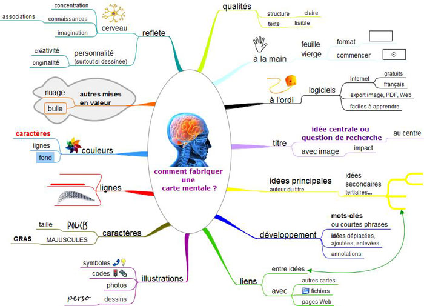

Sur cette page, des ==**outils méthodologiques**== et des des ==**ressources par discipline**==.

## Méthodologie
??? info "Information générale"
    - [**Apprendre à s'organiser**](./pdf/Méthodologie_Apprendre_a_travailler.pdf){target=_blank}
    - [**Apprendre à réviser**](https://apprendre-reviser-memoriser.fr/){target=_blank}
    - **D'autres exemples de cartes mentales** [**ici**](https://www.ebsi.umontreal.ca/jetrouve/projet/cartes_m/galerie.htm){target=_blank}
    {center=80%}
   

??? "Rechercher des informations"
    - [**Base documentaire PMB du lycée**](https://ecmorlaix.basecdi.fr/pmb/opac_css/index.php){target=_blank}
    - [**Chercher pour trouver**](https://www.ebsi.umontreal.ca/jetrouve/){target=_blank}
    - [**Vérifier une information sur Internet**](https://fr.wikihow.com/v%C3%A9rifier-l%E2%80%99information-sur-internet){target=_blank}
    - [**Prendre des notes**](./pdf/Méthodologie_Prendre des notes.pdf){target=_blank}
    - [**Elaborer une problématique**]
    

??? "Présenter le résultat de ses recherches, fiches outils et conseils..."
    - [**Faire un exposé**](./pdf/Méthodologie_Faire un exposé.pdf){target=_blank}
    - [**Faire une revue de presse**](./pdf/Méthodologie_Faire une revue de presse.pdf){target=_blank}
    - [**Réaliser une affiche**](./pdf/Méthodologie_Réaliser une affiche.pdf){target=_blank} 
    - [**Réaliser un diaporama**](./pdf/Méthodologie_Réaliser un diaporama.pdf){target=_blank}
    - [**Citer ses sources**](./pdf/Méthodologie_Citer ses sources bibliographiques.pdf){target=_blank}
  
    
??? "Applications"
    - [**PIX**](https://pix.fr/){target=_blank} : S'entraîner pour développer ses compétences numériques en vue de la certification de terminale.
    - [**Tutoriel pour une présentation avec PREZI**](https://prezi.com/r9ju2zs5ki65/guide-prezi-en-francais/){target=_blank}

___
## EMI
??? Pourquoi "Pourquoi et comment s'informer ?" 
    
    * S'informer pour comprendre le monde
    
    * Connaître et croiser les sources d'informations
    
    * Développer son esprit critique.
    
    * Lutter contre la désinformation.
    
    * Gérer ses données personnelles.
    
    * Maîtriser son temps d'écrans.
    
    
??? Info "Sites incontournables pour s'informer"
    - [**AFP**](https://www.afp.com/fr){target=_blank}
    - [**Reporters sans frontières**](https://rsf.org/){target=_blank}
    ...
 

??? info "Ressources pour l'EMI"
    [**Padlet de ressources**](https://padlet.com/cdinddmporsmeur/emi){target=_blank}

___
## Concours scolaires

??? info "Concours de critique"
    En octobre et novembre, les élèves de 1G1 et 1G3, ont participé au [**concours de critique littéraire**](https://www.bruitdelire.org/concours-de-critique-litteraire/){target=_blank} organisé par la Région Bretagne en partenariat avec le Rectorat de Rennes et l’association **"Bruit de lire"**. L’objectif pour les élèves est de rédiger une critique sur l’un des romans de la sélection en lice pour le **Prix Goncourt des Lycéens**.
    
    En apprenant à exprimer leur pensée et à argumenter, les lycéens avancent vers leur autonomie. Au-delà du « j’aime » / « je n’aime pas », les élèves apprennent à formuler une appréciation personnelle sur l’œuvre qu’ils ont choisie et à justifier leur avis. En s’exerçant à ce genre particulier, ils développent de véritables compétences d’argumentation.
___

??? info "Si on lisait à voix haute"
    Dans le cadre de l'AP, 19 élèves de seconde générale participent cette année au concours [**"Si on lisait à voix haute"**](https://www.lumni.fr/dossier/la-grande-librairie-concours-de-lecture-a-voix-haute){target=_blank} organisé par François Busnel et la Grande Librairie.

    Leurs motivations et leurs attentes au moment de choisir cet atelier étaient diverses : pour certains la **curiosité**, pour d’autres, l’**envie de travailler l’oral** et de **gagner en aisance**, pour d’autres encore, aimant déjà lire à voix haute, le **désir de participer à un concours national**, quelques-uns, aussi, sans motivation particulière, parce que s’étant inscrits dans cet atelier un peu par défaut.
    
    Ensembles, ils ont choisi de relever le défi proposé par le concours et se sont engagés à travailler pour progresser dans cet exercice de lecture à voix haute, à s'entraider pour exceller et donner le meilleur d'eux-mêmes.

    Découvrez cet atelier pédagogique sur le [**Padlet du groupe d'AP**](https://padlet.com/cdinddmporsmeur/concours_lagrandelibrairie){target=_blank}.
    {width=35% align=right}
    <figure>
    <video width="560" height="315" controls>
    <source src="./videos/Finaliste_2022_compressee.mp4" type="video/mp4">  
    </video>
    </figure>
___

??? info "Prix folio des lycéens"
    Petit parcours vers la **littérature contemporaine** : à travers des activités variées, découvrir 6 titres récents aux thèmes diversifiés ; partager ses impressions de lecture par oral et par écrit ; affiner ses goûts, développer son esprit critique en attribuant « coups de cœur » et « coups de griffe » et en votant pour son roman préféré.
    
    Une manière décontractée de se préparer aux épreuves anticipées de Français (écrites et orales) et au Grand Oral du bac !
    
    Informations et actualités du [**Prix folio**](https://www.prixdeslyceensfolio.fr/){target=_blank} sur le site.
    
___
## Seconde générale

??? info "AP 2nde générale"
    Dans le cadre de l'**accompagnement personnalisé** de la classe de seconde, les élèves participent à un **projet long** et trois **projets courts**.
    
    L’objectif est de les guider dans leurs choix d'orientation, en leur proposant soit des modules de découverte variés où ils pourront exprimer leurs talents, soit des activités liées à une discipline spécifique, ou encore des outils pour les aider à surmonter des difficultés identifiées.
     
    ==**PROJETS LONGS**== (*27 semaines*)
    
    * Faire des sciences dans le cadre d’une enquête policière
    
    * J’aime lire et je participe au « Prix Folio des lycéens »
    
    * Ecrire à la façon d’un journaliste pour « Le journal du lycée »
    
    * Science-Fiction, Fantasy, Fantastique : si j’écrivais des nouvelles de SFFF
    
    * Les maths, j’adore, je veux approfondir
    
    * Création et innovation technologique : des idées plein la tête pour des projets concrets
    
    * « Et si on lisait à voix haute » un concours pour travailler mon oral
    
    * Webradio-capsules vidéos : créer des mini-reportages à diffuser sur l’ENT
    
    * Une Entreprise dans votre lycée
    
    ==**PROJETS COURTS**== (*9 semaines*)
    
    * Soutien matière : maths (3 groupes)
    
    * Soutien matière français
    
    * Prix de l’écoute (Podcast)
    
    * Travailler les compétences de l’oral
    
    * S’initier à la philosophie
    
    * S’initier aux Sciences de l’ingénieur
    
    * S’initier au mangement
    
    * Maths approfondies

    
___
## Disciplines
### Arts plastiques

### EPS

### Français

### Histoire Géographie EMC

### Langues vivantes

### Mathématiques

### Philosophie

### Physique-Chimie

### SES

### SVT

___
## Enseignements de spécialité (au lycée)
Pour le bac général et technologique, pendant l’année de 2de, les élèves choisissent 3 spécialités qu'ils étudieront pendant la classe de 1re, en fonction de leurs goûts et de leurs motivations. Pour la terminale ils choisiront de conserver 2 des spécialités étudiées en 1re..
    
???+ info "Choix des spécialités"
    Pour bien choisir vos spécialités, découvrir les attendus et les programmes de première et de terminale, pour chacune d'entre elles, rendez-vous sur le site du [**Ministère de l'Education Nationale**](https://www.education.gouv.fr/reussir-au-lycee/choisir-ses-specialites-au-lycee-pour-preparer-ses-etudes-superieures-325475){target=_blank} ou sur le site de [**l'Etudiant**](https://www.studyrama.com/formations/diplomes/bac/les-programmes-et-attendus-des-12-specialites/){target=_blank}.
    
    D'autres sites d'informations sur les spécialités sont à découvrir sous l'onglet [**orientation**](https://jocedoc.github.io/mon_premier_site/orientation/){target=_blank} du présent site, vers le padlet SECONDE.
    
    Ci-dessous, des ressources utiles pour l'enseignement des spécialités proposées dans notre lycée.
   
### HGGSP

??? "Programmes"
    Sur le site [**Eduscol**](https://eduscol.education.fr/1676/programmes-et-ressources-en-histoire-geographie-geopolitique-et-sciences-politiques-voie-g){target=_blank}.
    
    
??? "Ressources" 
    - [**Le dessous des cartes**](https://www.arte.tv/fr/videos/RC-014036/le-dessous-des-cartes/){target=_blank} : le magazine géopolitique d'Arte.
    - [**France Culture**](https://www.franceculture.fr/geopolitique){target=_blank} : Analyses et décryptages : comprendre les relations internationales et la géopolitique du monde actuel grâce aux émissions et podcasts de France Culture.
    - [**Lumni**](https://www.lumni.fr/recherche?query=G%C3%A9opolitique&establishment=lycee&schoolLevel=seconde){targert=_blank} : Série Géopoliticus pour décrypter la géopolitique à l’aide d’infographies animées pour comprendre le monde et les grands enjeux politiques de notre temps.
    - [**IRIS - Institut de Relations Internationales et Stratégiques**](https://www.iris-france.org/){target=_blank}
    
    
??? "Séances pédagogiques"   
    [**Faire une revue de presse thématique**](./pdf/HGGSP_1re_revue de presse thématique.pdf){target=_blank}
    
    
??? "Etudes et géopolitique"
    Si la géopolitique vous intéresse, pourquoi ne pas continuer vos études dans cette voix à l'[**Institut Français de géopolitique**](https://www.geopolitique.net/fr/){target=_blank}
       

### HLP
??? "Programmes"
    Sur le site [**Eduscol**](https://eduscol.education.fr/1711/programmes-et-ressources-en-humanites-litterature-et-philosophie-voie-g){target=_blank}
    
??? "Ressources" 
    - [**Le pouvoir de la parole**](https://www.franceculture.fr/emissions/les-chemins-de-la-philosophie/le-pouvoir-de-la-parole-14-parler-est-ce-agir){target=_blank} : Série de quatre émissions sur le pouvoir de la parole, diffusées sur France Culture en novembre 2019. (^^Episode 1^^ : Parler est-ce agir ? - ^^Épisode 2^^ : Quand la parole ne suffit pas : les stoïciens au secours de l’écologie - ^^Épisode 3^^ : Quand dire, c’est guérir - ^^Épisode 4^^ : Devient-on quelqu’un d’autre quand on ment ?).

    
### LLCE
??? "Programmes"
    Sur le site [**Eduscol**](https://eduscol.education.fr/1684/programmes-et-ressources-en-langues-litteratures-et-cultures-etrangeres-et-regionales-voie-g){target=_blank}

??? "Ressources" 
    
    
    
### Mathématiques
??? "Programmes"
    Sur le site [**Eduscol**](https://eduscol.education.fr/1723/programmes-et-ressources-en-mathematiques-voie-gt){target=_blank}

??? "Ressources" 
    - [**Spécialité maths**](http://specialite-maths.fr/){target=_blank}
    - [**M@th et tiques**](https://www.maths-et-tiques.fr/index.php/cours-maths){target=_blank}
    - [**Kahn Academy**](https://fr.khanacademy.org/){target=_blank} : Cours en mathématiques...
    - [**Podcast - France Culture**](https://www.franceculture.fr/theme/mathematiques){target=_blank}
    
### NSI
??? "Programmes"
    Sur le site [**Eduscol**](https://eduscol.education.fr/2068/programmes-et-ressources-en-numerique-et-sciences-informatiques-voie-g){target=_blank}

??? "Ressources" 
    - [**Histoire de l'informatique, d'Internet et du Web**](https://delmas-rigoutsos.nom.fr/documents/YDelmas-histoire_informatique/index.html){target=_blank}
    - [**Cours sur Python**](https://courspython.com/){target=_blank}
    - [**Kahn Academy**](https://fr.khanacademy.org/){target=_blank} : Cours en mathématiques, sciences, informatique, économie et finance, arts.
    - [**PIXEES**](https://pixees.fr/){target=_blank} : ressources pour les sciences du numérique.
    
### SVT
??? "Programmes"
    Sur le site [**Eduscol**](){target=_blank}

??? "Ressources" 
    - {target=_blank
    
### SI
??? "Programmes"
    Sur le site [**Eduscol**](){target=_blank}

??? "Ressources" 
    - {target=_blank

### SES
??? "Programmes"
    Sur le site [**Eduscol**](){target=_blank}

??? "Ressources" 
    - {target=_blank

### Physique Chimie 
??? "Programmes"
    Sur le site [**Eduscol**](){target=_blank}

??? "Ressources" 
    - {target=_blank

___
## Réviser pour le BAC

??? info "S'organiser"

??? info "Sites pour réviser"

  
## Le Grand oral
   
??? info "Se préparer pour l'oral"
    [**Padlet de ressources pour le Grand Oral**](https://padlet.com/cdinddmporsmeur/grandoral2021){target=_blank}
